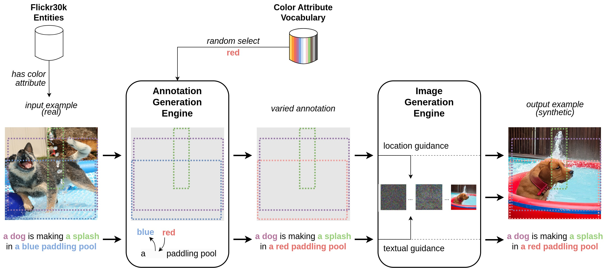
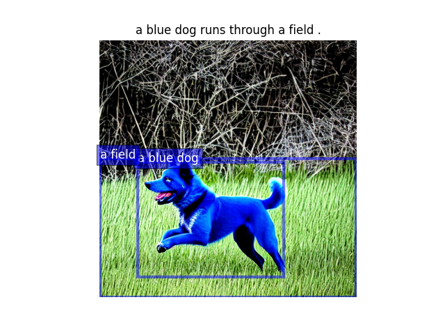
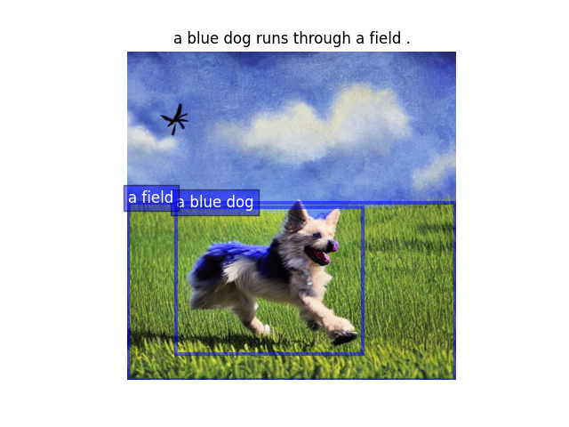

# Harlequin: Color-driven Generation of Synthetic Data for Referring Expression Comprehension

[Luca Parolari](https://github.com/lparolari), [Elena Izzo](https://www.linkedin.com/in/elena-izzo-b87b69164), [Lamberto Ballan](http://www.lambertoballan.net/)

[[Paper]](https://openreview.net/forum?id=EZYvU2oC6J)


## About

Referring Expression Comprehension (REC) aims to identify a particular object in a scene by a natural language expression, and is an important topic in visual language understanding.

State-of-the-art methods for this task are based on deep learning, which generally requires expensive and manually labeled annotations. Some works tackle the problem with limited-supervision learning or relying on Large Vision and Language Models. However, the development of techniques to synthesize labeled data is overlooked. 

In this paper, we propose a novel framework that generates artificial data for the REC task, taking into account both textual and visual modalities. 
At first, our pipeline processes existing data to create variations in the annotations. 

Then, it generates an image using altered annotations as guidance. The result of this pipeline is a new dataset, called *Harlequin*, made by more than 1M queries. 

This approach eliminates manual data collection and annotation, enabling scalability and facilitating arbitrary complexity.

We pre-train two REC models on Harlequin, then fine-tuned and evaluated on human-annotated datasets. Our experiments show that the pre-training on artificial data is beneficial for performance.

[Read the paper 🚀](https://openreview.net/forum?id=EZYvU2oC6J)

## Our pipeline



## Download

We release Harlequin annotations and images at this link: [[Google Drive]](https://drive.google.com/drive/folders/138PNh5tBOPM8eBlpS6hfN1e_6NYvkz4I?usp=sharing).

> ⚠ images will be available soon for download

Harlequin is exported in coco format, and provides three annotation files (one per split) in the `annotations` folder. Images can be found in the `images` folder.

```
data
`-- harlequin
    |-- annotations
    |   |-- instances_train.json
    |   |-- instances_val.json
    |   `-- instances_test.json
    `-- images
```

## Installation

* (Optional) Setup the environment with Anaconda (or [Miniconda](https://docs.anaconda.com/free/miniconda/index.html))
* Python >= 3.10

```
pip install harlequin-dataset
```

## Usage

### Basic usage

```python
from harlequin import HarlequinDataset

harlequin = HarlequinDataset(
    "data/harlequin/images",
    "data/harlequin/annotations/instances_test.json"
)

print(len(harlequin))  # 13434
```

### Using targets

```python
from harlequin import HarlequinDataset

ds = HarlequinDataset(
    "data/harlequin/images", "data/harlequin/annotations/instances_test.json"
)

i = 0  # simulating a training setp

sample_id = ds.get_id(i)

img = ds.get_image(sample_id)
img_ann = ds.get_image_ann(sample_id)
tgt_ann = ds.get_target_ann(sample_id)

# harlequin comes with both captions and queries,
# we can extract queries from caption using indexes
caption = img_ann["caption"]
queries = [
    caption[query_pos[0] : query_pos[1]]
    for tgt in tgt_ann
    if (query_pos := tgt["tokens_positive"][0])
]

print(caption)
# The man with a gray jacket and cyan sunglasses is holding cameras and standing in front of a car .

print(queries)
# ['cyan sunglasses', 'a gray jacket', 'cameras', 'a car', 'The man']

# each target has a bounding box associated, identifying it in the image
boxes = [tgt["bbox"] for tgt in tgt_ann]

print(boxes)
# [[222, 120, 115, 35], [53, 164, 438, 292], [83, 336, 356, 136], [1, 372, 464, 139], [56, 70, 432, 441]]
```

### Reference API

The `HarlequinDataset` class inherits from `torchvision.datasets.CocoDetection` and this from `torch.utils.data.Dataset`.

It provides two standard methods:

* `__len__` to retrieve dataset length, and
* `__getitem__` to retrieve a dataset sample along with its annotations by id. This method returns a tuple, where the first element is a `PIL.Image.Image` representing the image and the second a list of dicts representing targets. (See below for target.)

Our implementation provides few additional methods that simplify the interface and, in some cases, make the code faster.

* `get_id`, return the `int` representing the sample id associated to given index;
* `get_image`, return the `PIL.Image.Image` image instance given sample id;
* `get_image_ann`, return image's annotations given sample id in the form of a dict with the following structure
```python
dict_keys([
    'id',
    'original_img_id',
    'width',
    'height',
    'caption',
    'file_name'
])
```
* `get_target_ann`, return target's annotations given sample id in the form of a list of dict with following structure:
```python
dict_keys(['area',
    'iscrowd',
    'image_id',
    'category_id',
    'id',
    'bbox',
    'tokens_positive',
    'phrase_ids',
    'query',
    'sentence',
    'image_w',
    'image_h'
])
```

### Tools

We provide some useful scripts to search and visualize samples in the dataset.

#### Search the dataset

Run `python -m tools.ds_search --help` for more information.

```
$ python -m tools.ds_search --root fake --ann_file data/harlequin/annotations/instances_test.json --search "a \w+ dog runs through a field" 
sample_id                                i     caption
---------------------------------------  ----  ----------------------------------
45832072286111431511163412646150256014   1815  a blue dog runs through a field .
47795822623162357528822822313898616472   1896  a blue dog runs through a field .
73296849640710715671926387036903824163   2922  a white dog runs through a field .
120493081802089305802189965019655331752  4823  a green dog runs through a field .
171348737941932910553095239170133267695  6757  a black dog runs through a field .
251972281794307404298339469034250622018  9951  a red dog runs through a field .
Found 6 entries
```

#### Visualize some samples

```
$ python -m tools.ds_show --root data/harlequin/images --ann_file data/harlequin/annotations/instances_test.json --index 1815 1896  --visualize annotation
```



## Citation

```
@inproceedings{parolari2024harlequin,
  title={Harlequin: Color-driven Generation of Synthetic Data for Referring Expression Comprehension},
  author={Parolari, Luca and Izzo, Elena and Ballan, Lamberto},
  booktitle={Synthetic Data for Computer Vision Workshop@ CVPR 2024}
}
```

## Development

Please read the [CONTRIBUTING.md](CONTRIBUTING.md) file to setup a development environment and submit your contribution.

This repository is structured as follows:

- `data` contains datasets (images, annotations, etc)
- `docs` contains documentation about the project
- `notebooks` contains `*.ipynb` files
- `harlequin` is the main package
- `tests` contains possible unit tests
- `tools` contains useful scripts and commands for the project

### Utils

Our [Makefile](Makefile) provides some utilities for testing and formatting the code:

```bash 
❯ make
Usage: make <target>

Targets:
help:                  ## Show the help.
fmt:                   ## Format code using black & isort.
test:                  ## Run tests.
test-cov:              ## Run tests and generate coverage report.
virtualenv:            ## Create a virtual environment.
install:               ## Install dependencies.
precommit-install:     ## Install pre-commit hooks.
precommit-uninstall:   ## Uninstall pre-commit hooks.
release:               ## Create a new tag for release.
```

Specifically, 

* `test` runs pytest and executes all the unit tests listed in [`tests`](tests) folder
* `fmt` formats the code using black and organizes the import though `isort`

**Manual commands**

If you want to manually run those utilities use:

* `pytest -v --cov-config .coveragerc --cov=harlequin -l --tb=short --maxfail=1 tests/` for testing
* `coverage html` for the coverage report
* `isort *.py harlequin/` to organize imports
* `black *.py harlequin/` for the code style

